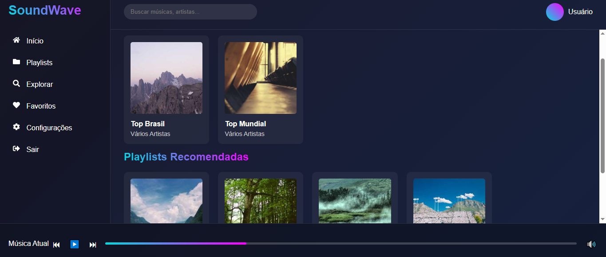

# Soundwave

Soundwave é uma aplicação front-end desenvolvida em React, com foco em interfaces modernas, responsivas e interativas. O projeto utiliza diversas bibliotecas populares para gerenciamento de formulários, animações, roteamento e estilização, garantindo uma experiência de usuário fluida e agradável.

## Funcionalidades

- Gerenciamento eficiente de formulários com validação via Yup.

- Navegação dinâmica entre páginas com React Router.

- Animações e transições suaves com Framer Motion.

- Feedback ao usuário com notificações usando React Toastify.

- Estilos customizados com styled-components.

### Tecnologias e dependências principais

React 19.1.0

React Router DOM 7.6.0

React Hook Form 7.56.4

Yup 1.6.1

Styled Components 6.1.18

Framer Motion 12.12.1

Axios 1.9.0

React Toastify 11.0.5

## Funcionalidades

Tela de Login: Permite que usuários se autentiquem para acessar o sistema.

Tela de Cadastro: Permite que novos usuários criem uma conta para utilizar o Soundwave.

Dashboard: Página principal.

Gerenciamento de Playlists:

Listar todas as playlists criadas pelo usuário.

Criar novas playlists personalizadas.

Adicionar músicas às playlists existentes.

Deletar músicas indesejadas das playlists.

Deletar playlists.

## Integração com API externa

O Soundwave utiliza a API do Jamendo para buscar músicas de forma dinâmica, permitindo que os usuários pesquisem faixas para adicionar às suas playlists.

```
https://api.jamendo.com/v3.0/tracks/?client_id=SEU_CLIENT_ID&search=

```

client_id: Sua chave de cliente obtida ao se registrar no Jamendo.

search: Termo que o usuário deseja buscar, como nome da música, artista, etc.

As músicas retornadas são exibidas no sistema para que o usuário possa escolher e adicionar às suas playlists.

### Chave de acesso (client_id)

Para usar a API do Jamendo, é necessário se cadastrar no site do Jamendo e gerar uma chave de cliente (client_id). Essa chave é usada para autenticar as requisições à API.

Você pode:

Criar sua própria chave cadastrando-se gratuitamente no Jamendo Developer.

Ou usar uma chave de exemplo para testes (256a8b01).

# Integração com API

```
Clone o repositório: https://github.com/suellykarine/api-sound-wave

```

### Home


### Cadastro


### Login


### Dashboard



### Playlist


### Modal de adicionar músicas


